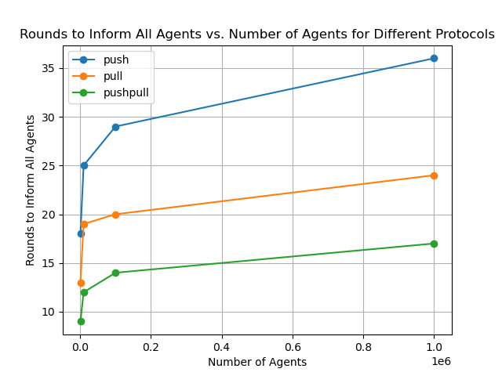
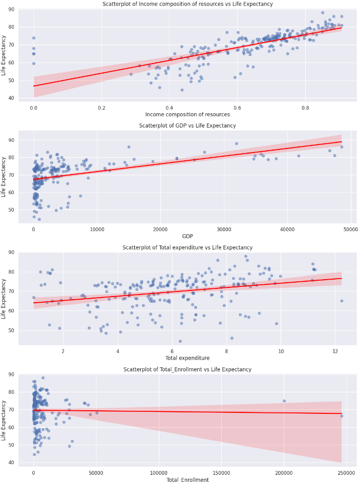

# data-mining-projects
Repository for Data Mining course projects.

# Project 1: [Rumor Spreading Simulation](rumo-simulation/)
### Result and Observation

This project simulates the efficiency of different rumor spreading protocols (push, pull, and push-pull) in a network of agents. The protocols are compared based on the number of rounds required to spread the rumor to all agents.

In the simulation, I observed significant differences in the number of rounds required to inform all agents, depending on the protocol used.

- **Push Protocol**: This protocol took the longest to spread the rumor, as only informed agents actively spread the information. This limits the diffusion rate to the actions of already-informed agents.

- **Pull Protocol**: The pull protocol performed moderately well, as uninformed agents actively seek information. However, it lacks the proactive spreading found in the push-pull protocol.

- **Push-Pull Protocol**: This was the most efficient protocol, requiring the fewest rounds. Combining both the push and pull strategies, it enables faster spread by allowing both informed and uninformed agents to participate actively in the dissemination process.

These results indicate that the push-pull protocol is the most efficient for complete rumor dissemination, as it optimizes the spread by combining both passive and active approaches.

# Project 2: [Life Expectancy Data Analysis](life-expectancy-data-analysis/)
This exercise examines the correlation between life expectancy and education levels using real-world data from Kaggle. After data cleaning and exploratory analysis, we found that the UN's data on student enrollment does not provide clear insights when combined with the Kaggle dataset, preventing definitive conclusions about the direct impact of education on life expectancy. 

However, other factors like income composition of resources and GDP show stronger correlations with life expectancy. There is a strong positive linear relationship between income composition and life expectancy, suggesting that better income distribution and equitable access to resources are associated with higher life expectancy. 
GDP also has a moderate positive correlation with life expectancy, indicating that wealthier nations tend to have higher life expectancy, likely due to greater investments in healthcare, education, and infrastructure. No clear relationship was found between total educational enrollment and life expectancy; the data showed high variability and did not explain life expectancy trends, implying that education may influence life expectancy indirectly through factors like economic growth, awareness, or healthcare access.

# Project 3: [Market Basket Analysis](market-basket-analysis/)

This project performs Market Basket Analysis (MBA) to understand customer purchasing behavior. Using transactional data from the "Bread Basket" dataset, we implemented the Apriori algorithm to identify frequent itemsets and generate association rules. The workflow includes data preparation, exploratory data analysis (EDA), and visualization. The results reveal associations between commonly purchased items, providing insights for strategies like product placement, targeted promotions, and cross-selling. The analysis highlights how data-driven insights can enhance decision-making in retail and e-commerce.

# Project 4: [Historical Buildings in Hamburg](hamburg-monuments/)
