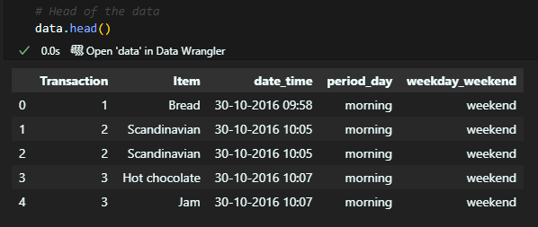
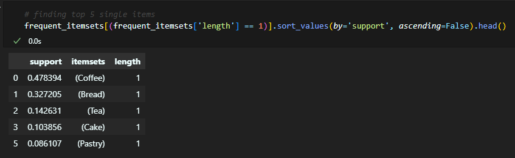
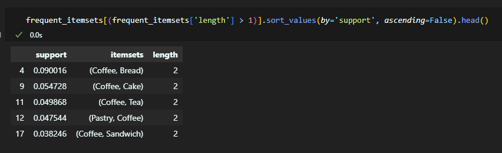
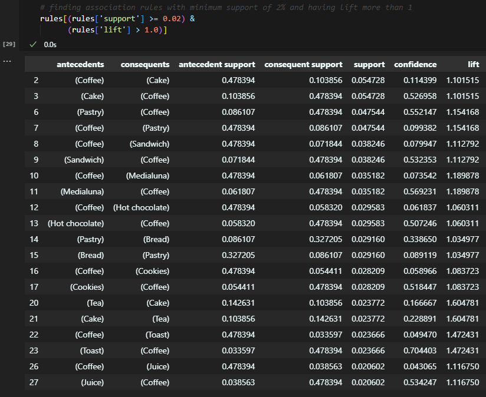
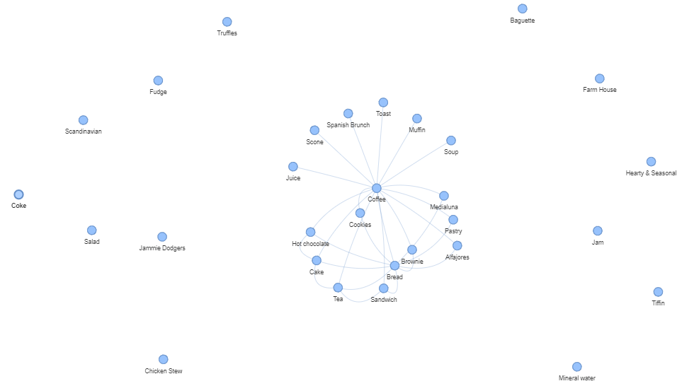
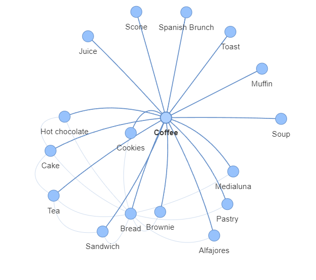
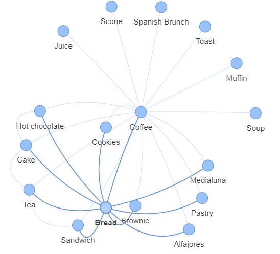

# Market basket analysis report

## Introduction

Market basket analysis - analysis of custumer behavior, if you buy produsts A and B, you are more likely to buy product C.

Our tutorial: https://www.kaggle.com/code/khusheekapoor/market-basket-analysis-in-python/notebook

Our data: https://www.kaggle.com/datasets/mittalvasu95/the-bread-basket

## Data

The data is a collection of 20.000+ transactions from a bakery.

Transactions are connected to a unique transaction ID, so we can see what products were bought together.

## Analysis

We used the Apriori algorithm to find association rules between products.

5 most common products, bought as a single item, are coffee, bread, tea, cake and pastry. 47% of all customers bought coffee, and 37% bought bread.

The most common pairs of products are coffee and bread, bread and tea, tea and cake, cake and bread, and coffee and cake.

The biggest association rule is between coffee and cake, with a support of 0.055, followed by coffee and pastry, coffee and sandwich, and coffee and medialuna (argentine croissant).

## Visualization

We used a network graph to visualize the association rules.

(for the interactive version, see the 'rules_graph.html' file)

## Conclusion

Key takeaways from our analysis are:

- Coffee is the most popular product, bought by 47% of all customers, and therefore most connected to other products.
- Top 5 products bought with coffee are bread, cake, tea, pastry and sandwich.

- Bread is the second most popular product, bought by 37% of all customers, and most connected to coffee, pastry and tea.

- All other products are connected to coffee and/or bread, but not to each other.
- There are some products, that have no connection to other products, like salad, baguette or coke.
